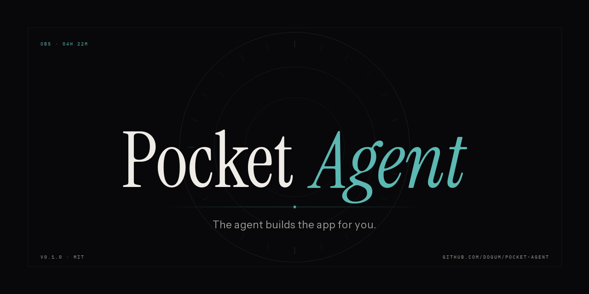
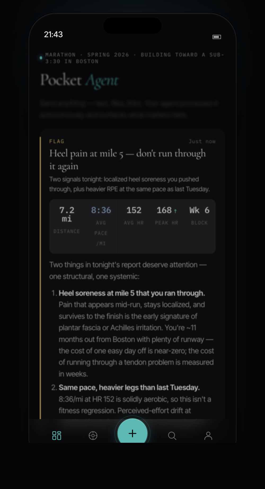

<p align="center">
  
</p>

# Pocket Agent

> **The agent builds the app for you.**

Pocket Agent is a local-first substrate where managed AI agents ingest the unstructured stuff from your life — text, photos, files, links — process it autonomously in long-running sessions, and surface the results as interactive artifacts composed from a reusable component library. Same code, totally different feel per user. The longer it runs, the more uniquely yours it becomes.

This is the open-source companion to the concept. It runs entirely on your machine against the **Anthropic Managed Agents** beta — your API key, your data, your SQLite file. No telemetry, no third parties.

<p align="center">
  
</p>
<p align="center">
  <em>A real run: send a paragraph about an evening run with a stray symptom; the agent surfaces a structured FLAG artifact composed from a data row, markdown analysis, alert, and a `question_set` for follow-up.</em>
</p>

## What it looks like

The agent emits one **Artifact** per ingest — a JSON object composed from a vocabulary of 24 component types: data rows, sparklines, line charts, tables, alerts, timelines, progress, comparisons, quotes, checklists, sources, status lists, images, maps, key/value lists, link previews, sandboxed HTML embeds, paragraphs, headings, dividers, markdown, **question sets** the user can fill in inline, and **reflex proposals** the user can approve to install agent-authored watchers. The agent picks, arranges, and styles them around your context — a marathon training session looks like a training app, a home renovation looks like a job tracker, a research project looks like a workbench.

Beyond user-driven turns, the agent can also act *ambiently*. Long-lived **Sources** (polled URLs, MCP servers, a built-in `fake_pulse` demo) emit observations between your inputs. Attach a source to a session and recent observations land in the agent's kickoff context. Approve a **reflex** and it fires automatically when its pattern matches. Mark an artifact as **living** with `subscribes_to` and it updates itself in place — with a pulsing LIVE badge and a version history sheet — as new observations arrive.

The signature motion is the **scan-bar** — four agent states (ingesting, thinking, drafting, watching) that tell you what the agent is doing at any moment. The design system is called the **Observatory**: Cormorant serif, IBM Plex Mono data, signal teal `#5CB8B2` accent, near-black field, fonts and tokens defined as CSS variables.

## Quick start

```bash
# 1. Install
pnpm install                # requires Node 20+ and pnpm 10+

# 2. Configure
cp .env.example .env
# Edit .env and paste your ANTHROPIC_API_KEY (must have Managed Agents beta access)

# 3. Provision your agent (one time, also re-run any time you edit src/agent-prompt.ts)
pnpm bootstrap-agent
# Creates an environment + agent in your Anthropic org, prints IDs,
# and appends them to .env automatically.

# 4. Run
pnpm dev
# API on :8787, web app on :5173 — open http://localhost:5173
```

The first time you open the app, you'll see onboarding. Name your first session — anything that captures a long-running thread of work or curiosity. Then tap `+` and send something. The agent will produce its first artifact within seconds to a couple of minutes depending on what you sent.

## How the loop works

```
User                  Web (Vite)              Server (Hono)             Anthropic
 │                                                                          │
 │  type / drop a file                                                      │
 ├────────────────────▶                                                     │
 │            POST /api/ingests                                             │
 │            POST /api/run { session_id, ingest_id }                       │
 │                                                                          │
 │                          ──── streamSession() ────────▶                  │
 │                          1. Reuse or create managed session              │
 │                          2. events.stream  (BEFORE step 3)               │
 │                          3. events.send  user.message                    │
 │                          4. drain w/ idle-break gate                     │
 │                                                                          │
 │            ◀────  SSE: agent.text_delta · tool_use · artifact.ready · run.done
 │  feed updates live; artifact card appears                                │
```

Two patterns are baked into the orchestrator and shouldn't move:

1. **Stream-first ordering** — open the Anthropic SSE stream BEFORE sending the kickoff `user.message`. Reverse the order and you lose real-time reactivity.
2. **Idle-break gate** — `session.status_idle` fires transiently while the agent waits on tool confirmations. Only break on `status_terminated` or on `status_idle` whose `stop_reason.type` is NOT `requires_action`.

One local session reuses the same managed session across every ingest, so the agent keeps context across turns. When the managed session terminates or returns 404 (Anthropic-side reap), the orchestrator falls back to creating a fresh one.

## The contract: `Artifact`

Every output the agent produces is an `Artifact`. The agent emits one as JSON; the renderer dispatches on `component.type` for each entry in the array.

```ts
{
  header: {
    label: "ALERT",                          // mono caps category
    title: "Recovery day before Thursday",
    summary: "AC ratio hit 1.38…",
    timestamp_display: "Just now",
    label_color: "signal"                    // signal | cool | green | amber | red | muted
  },
  priority: "high",
  notify: true,
  components: [
    { type: "data_row", cells: [...] },
    { type: "question_set", questions: [...] },
    { type: "alert", severity: "warning", text: "…" }
  ],
  actions: [
    { label: "Accept plan change", action: "confirm", primary: true },
    { label: "Why?", action: "follow_up", prompt: "Explain the AC ratio threshold." }
  ]
}
```

The full schema lives in [`shared/artifact.ts`](shared/artifact.ts). The renderer is in [`web/src/components/artifact/ArtifactRenderer.tsx`](web/src/components/artifact/ArtifactRenderer.tsx). The agent's system prompt is in [`src/agent-prompt.ts`](src/agent-prompt.ts) — to change the agent's behavior, edit that file and rerun `pnpm bootstrap-agent` to sync.

## Tech stack

| Layer    | Choice                                       | Why                                                              |
|----------|----------------------------------------------|------------------------------------------------------------------|
| Frontend | React 18 + Vite + TypeScript                 | Fast HMR, mature, no surprises                                   |
| Styling  | CSS variables (Observatory tokens) + Tailwind | Tokens drive the theme; Tailwind for utility layout              |
| State    | [Zustand](https://github.com/pmndrs/zustand)  | One ephemeral store + one persisted settings store               |
| Backend  | [Hono](https://hono.dev) on Node 20+         | Edge-runtime-portable, tiny                                      |
| DB       | [better-sqlite3](https://github.com/WiseLibs/better-sqlite3) + FTS5 | Synchronous, fast, single-file; FTS5 for search             |
| Scheduler | [node-cron](https://github.com/node-cron/node-cron) | Per-session cron-style agent triggers, executed in-process    |
| Agent    | Anthropic Managed Agents SDK                  | Stateful sessions, hosted tool execution, sandbox containers    |

## Project layout

```
pocket-agent/
├── shared/                       Type contract used by both web and server
│   ├── artifact.ts                24 component types as a discriminated union
│   ├── session.ts                 Session, Ingest, Briefing, Trigger
│   ├── source.ts                  Source, Observation, Reflex, ArtifactSubscription
│   └── events.ts                  SSE event taxonomy
├── src/                          Hono API server
│   ├── index.ts                   Entry — mounts /api/* routes, initializes scheduler
│   ├── client.ts                  Anthropic SDK wrapper + dotenv loader
│   ├── db.ts                      SQLite schema + migrations + row mappers
│   ├── agent-prompt.ts            Source of truth for the agent's system prompt
│   ├── bootstrap-agent.ts         One-time provisioning / sync CLI
│   ├── orchestrator/              Talks to Anthropic
│   │   ├── streamSession.ts        Core run helper (stream-first + idle-break + session reuse)
│   │   ├── parseArtifact.ts        Validate the agent's final JSON
│   │   ├── persistArtifact.ts      Write artifact + seed version history; resolve source slugs
│   │   ├── buildPrompt.ts          Assemble kickoff context (incl. <recent_observations>)
│   │   ├── observations.ts         Write path + fan-out to reflexes and living artifacts
│   │   ├── reflexEval.ts           Fire one reflex through the run queue
│   │   ├── agentUpdate.ts          Scoped in-place artifact update entry point
│   │   ├── sourcePoll.ts           Polled-URL source backend
│   │   ├── mcpClient.ts            MCP source backend (transport skeleton)
│   │   └── fakePulse.ts            Built-in demo source
│   ├── lib/
│   │   ├── scheduler.ts            node-cron registry for per-session triggers
│   │   ├── runQueue.ts             Per-session priority queue (user > trigger > reflex > update)
│   │   ├── eventBus.ts             In-process pub/sub for ambient events
│   │   ├── uploads.ts              Anthropic Files API helpers + local byte cache
│   │   ├── id.ts                   Stable sortable ids
│   │   └── log.ts                  Branded terminal logging
│   └── routes/                    One file per resource (sessions, ingests, artifacts,
│                                  run, files, sources, reflexes, events, …)
└── web/                          React + Vite SPA
    ├── index.html
    └── src/
        ├── App.tsx
        ├── store/                  Zustand: ephemeral state + persisted settings
        ├── hooks/                  useLiveStream, useRunDispatcher
        ├── components/             Icon library, shell primitives, ArtifactRenderer
        ├── screens/                Feed, ArtifactDetail, Sessions, Triggers, Privacy, …
        └── styles/                 Observatory theme tokens (.css)
```

Local user data (SQLite DB, file uploads, agent state) lives in `data/` (gitignored).

## Scripts

| Script                    | What it does                                                      |
|---------------------------|-------------------------------------------------------------------|
| `pnpm dev`                | API on `:8787` and Vite on `:5173`, both with hot reload          |
| `pnpm dev:api`            | Just the API (tsx watch)                                          |
| `pnpm dev:web`            | Just the web (vite)                                               |
| `pnpm build`              | Production web bundle to `web-dist/`                              |
| `pnpm bootstrap-agent`    | Provision or sync the managed agent to your Anthropic org         |
| `pnpm type-check`         | Server + web TypeScript check                                     |

## What's local vs what hits the network

**Local-only:**
- All your sessions, ingests, artifacts, briefings (SQLite at `data/app.db`)
- File upload byte cache (`data/uploads/<file_id>`)
- Settings persisted in `localStorage` under `pocket-agent:settings`
- Agent state (`data/app.db` `agent_state` table)

**Sent to Anthropic:**
- The agent's system prompt (once at bootstrap, re-synced on edit)
- The kickoff message for every ingest (includes recent session context)
- File bytes for any photo / file / voice ingest, via the Anthropic Files API

No telemetry. No third parties.

## Status

Pocket Agent is at **v0.1.0** — a single-user local build. The architecture is clean enough that multi-user / auth / hosted deployment are achievable later, but they're deliberately out of scope today.

What's in v0.1.0:

- ✅ Onboarding cinematic (5-step)
- ✅ Feed, session detail, artifact detail, search (FTS5)
- ✅ 23 artifact component types incl. interactive `question_set` and `checklist`
- ✅ Universal Reply on every artifact (preserves agent context across turns)
- ✅ Per-session cron triggers with a real scheduler + execution
- ✅ Session lifecycle (archive, complete, delete with typed confirmation)
- ✅ Privacy & data screen with export + clear-all
- ✅ Browser desktop notifications when the window is hidden
- ✅ Native in-app confirm dialogs (no browser popups)
- ✅ Profile with theme (auto/light/dark), accent, density, atmosphere, grain
- ✅ Run queue + banner when ingesting while the agent is mid-stream
- ✅ Double-click-safe submit
- ✅ Local-only by design — no telemetry, no third parties

What's deferred for later releases:

- Voice ingest
- Per-session MCP servers
- Per-session memory store integration
- Multi-user / auth / hosted demo
- Capacitor wrap for iOS/Android
- Live artifact-draft preview during streaming
- Briefing auto-generation
- Search narrowing (chips for type / session / date)

## Contributing

Issues and PRs welcome. See [`CONTRIBUTING.md`](CONTRIBUTING.md) for the contributor flow and the schema-extension lockstep.

## Security

Reporting a vulnerability: see [`SECURITY.md`](SECURITY.md).

## License

MIT — see [`LICENSE`](LICENSE).
